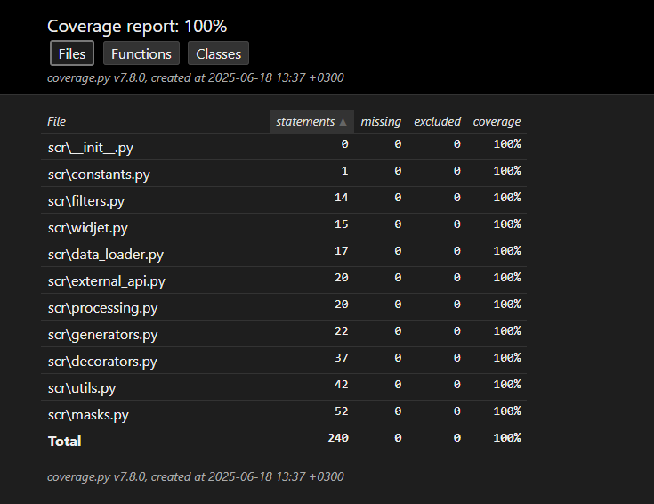

# MyFirstPython

## Описание: 
Учебный проект по изучению Python с нуля. 

Программа позволяет обрабатывать финансовые транзакции из разных источников (JSON, CSV, XLSX), фильтровать их по статусу, валюте и описанию, сортировать по дате, а также выводить результат в удобном виде с маскированием номеров карт и счётов. Взаимодействие происходит через консольный интерфейс.

Проект включает в себя домашние задания и практические упражнения по ключевым темам языка.

Проект развивается по мере прохождения новых тем — от основ до более продвинутых концепций.
Проект включает:
- генерацию номеров банковских карт;
- логирование функций с помощью универсального декоратора;
- чтение данных из JSON-файла с транзакциями;
- конвертацию валют по курсу с внешнего API с использованием `.env` для защиты ключей;
- модульные тесты с использованием `pytest`, `mock`, `patch`, с покрытием кода на 100%;
- логирование всех ключевых событий в модулях `utils.py` и `masks.py`.
- Использование различных библиотек таких как:
  - `pandas` и `openpyxl`  для чтения финансовых транзакций из файлов разных форматов; 
  - `datetime`, `dateutil`, `pytz` для работы и фильтрации с различными форматами дат;
  - `logging` для логирования;
  - `os` для работы с фалами;
  - `collections` для удобной работы с данными;
  - `re` для работы с регулярными выражениями;
  - `typing` для работы с аннотациями типов;
  - `requesst` для работы с HTTP-запросами
  
Проект оформлен с соблюдением стандартов PEP 8, используются линтеры, git-ветвление и pull-request практика.

## Установка:
1. Установка:

```git clone https://github.com/BykovMax/project1.git```

2. Установка зависимостей:

```poetry install```

## Структура проекта

- `scr/` — основной код
- `tests/` — модульные тесты
- `data/` — исходные файлы с транзакциями
- `logs/` — файлы логов

## Использование

Запустите программу:
```bash
python main.py
```

## Добавленные модули
### модуль `masks.py`
Модуль предоставляет функции для работы с банковскими картами 
- `get_mask_card_number` Принимает номер карты из 16 цифр и возвращает в формате "XXXX XX** **** XXXX", где Х это цифра номера карты.
XXXX XX** **** XXXX
- `get_mask_account` Принимает номер счета и скрывает его отображая в формате **XXXX, где Х это цифра номера.
- `mask_entity` Возвращает замаскированный номер карты или счёта используя `get_mask_card_number` и `get_mask_account` если это возможно.
- 
### Модуль `widjet.py`
Этот модуль  содержит функции для работы с новыми возможностями приложения.
- `get_date` Принимает на вход строку с датой в формате "ГГГГ-ММ-ДДTЧЧ:ММ:СС.ffffff" (ISO формат). Возвращает строку с датой в формате "ДД.ММ.ГГГГ".
- `mask_account_card` Принимает строку с номером карты или счета, определяет номер это или счет, накладывает нужную маску, возвращает строку с наложенной маской.

### Модуль `processing`
Модуль предоставляет функции для работы с банковскими операциями:
- `filter_by_state` Функция принимает список словарей и значение для ключа и возвращает новый список содержащий только те словари у которых ключ содержит переданное значение.
- `sort_by_date` Функция принимает список и сортирует его по убыванию.
- `filter_by_currency` Фильтрует транзакции по коду валюты (например, "RUB").

### Модуль `generators.py`
Модуль содержит генераторы для обработки и генерации данных:
- `filter_by_currency(transactions, currency_code='RUB')`: генератор, возвращающий транзакции с указанной валютой.
- `transaction_descriptions(transactions)`: возвращает описание каждой операции из списка транзакций.
- `card_number_generator(start, end)`: генератор номеров банковских карт в формате `'XXXX XXXX XXXX XXXX'`. Принимает числа или строки от `"0000000000000001"` до `"9999999999999999"`.

### Модуль `utils.py`
Модуль содержит вспомогательные функции для работы с данными:
- `read_operations_json(path: str)`: читает и возвращает список транзакций из JSON-файла. Возвращает пустой список, если файл не найден, пустой или содержит неверный формат.
- `get_unique_descriptions` Возвращает уникальные строки из поля 'description' всех операций.
- `generate_mapping_from_descriptions` Генерирует mapping вида {описание: описание}, чтобы вручную потом заменить категории.
- `find_unmapped_descriptions` Находит описания транзакций, которых нет в CATEGORY_MAPPING.
- `ask_yes_no` Запрашивает у пользователя ввод 'да' или 'нет' с повтором при ошибке. Возвращает True, если пользователь ответил 'да'.

### Модуль `external_api.py`
Модуль реализует конвертацию валют с использованием внешнего API:
- `convert_to_rub(transaction: dict)`: принимает словарь с транзакцией и возвращает сумму в рублях. Для валют USD и EUR использует API [exchangerates_data](https://apilayer.com/). Ключ доступа хранится в `.env`.

### Модуль `data_loader.py`
Добавлены функции для чтения финансовых транзакций из файлов разных форматов:
- `read_transactions_csv(path: str)` Считывает данные из CSV-файла и возвращает список словарей.
- `read_transactions_excel(path: str)` Считывает данные из Excel (XLSX) и возвращает список словарей.

Функции обрабатывают исключения и возвращают пустой список при ошибке загрузки.

### Модуль `decorators.py`
Модуль содержит универсальный декоратор `@log`, который используется для логирования работы функций и генераторов.
#### Возможности:
- логирует успешное выполнение функции;
- перехватывает и логирует исключения;
- поддерживает функции и генераторы;
- выводит логи в консоль или сохраняет в файл, если передан `filename`.


#### Пример использования:
```python
from scr.decorators import log

@log()
def add(a, b):
    return a + b

@log(filename="log.txt")
def divide(a, b):
    return a / b
```

Если функция завершается успешно, лог будет:
```
The add works
```

Если возникает ошибка:
```
The divide function returned an error.
Error: ZeroDivisionError.
Inputs: (1, 0), {}
```

### Модуль `logging (utils.py и masks.py)`
Реализовано логирование всех ключевых событий в модулях `utils.py` и `masks.py`.

- Для каждого модуля создан свой логгер (`logging.getLogger("имя_модуля")`)
- Логи записываются в папку `logs/`:
  - `utils.log` — для событий при чтении JSON
  - `masks.log` — для маскировки карт и счетов
- При каждом запуске лог-файлы **перезаписываются**
- Формат логов включает:
  ```
  время | модуль | функция | уровень | сообщение
  ```
- Успешные действия логируются с уровнем `DEBUG`
- Ошибки — с уровнем `ERROR`

### Модуль main.py

Добавлена главная функция `main`, которая реализует интерактивную консольную работу с пользователем.  
Пользователь может:

- выбрать источник данных: JSON / CSV / Excel (XLSX);
- фильтровать транзакции по статусу (`EXECUTED`, `CANCELED`, `PENDING`);
- при желании — отсортировать по дате (по возрастанию / убыванию);
- выбрать, показывать ли только рублёвые транзакции;
- отфильтровать транзакции по ключевому слову в описании;
- просмотреть список всех уникальных описаний операций (категорий);
- просмотреть итоговый список операций с маскировкой счётов и карт (`from`, `to`) и форматированием даты.

Вывод оформлен в читаемом формате:
```
08.12.2019 Открытие вклада
Счет **4321
Сумма: 40542 руб.
```

В случае пустой выборки — выводится сообщение:  
`Не найдено ни одной транзакции, подходящей под ваши условия фильтрации.`

## Тестирование
Для тестирования используется `pytest` и `mock/patch`.

### Запуск тестов 
Перейдите в корневую директорию проекта и выполните:
```
pytest
```

### Структура тестов
Все тесты находятся в папке `tests/` и охватывают различные аспекты работы проекта. Примеры покрываемых сценариев:
- Маскировка номеров карт и счетов;
- Генерация номеров карт;
- Фильтрация операций по статусу (`EXECUTED`, `CANCELED` и др.);
- Сортировка операций по дате (по убыванию и возрастанию);
- Обработка исключений, граничных и нестандартных данных;
- Загрузка данных из JSON-файлов, excel и csv файлов;
- Конвертация валют с мокированием внешнего API;
- устойчивой сортировки по дате (`sort_by_date`) с разными форматами;


### Примеры команд
Запустить только один конкретный файл с тестами:
```
pytest tests/test_masks.py
```
Если используете poetry, можно так:
```
poetry run pytest
```

### Отчёт о покрытии
Для генерации отчёта покрытия кода тестами используется `pytest-cov`.  
Чтобы создать HTML-отчёт покрытия:
```
pytest --cov=scr --cov-report=html
```
После выполнения появится папка `htmlcov/`, в которой будет файл index.html. Откройте `htmlcov/index.html` в браузере, чтобы просмотреть отчёт.  
Пример отчета:  



## Автор

[BykovMax](https://github.com/BykovMax)